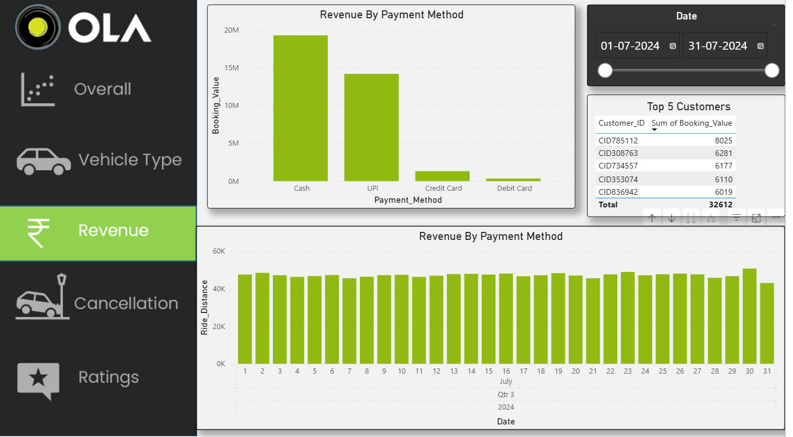
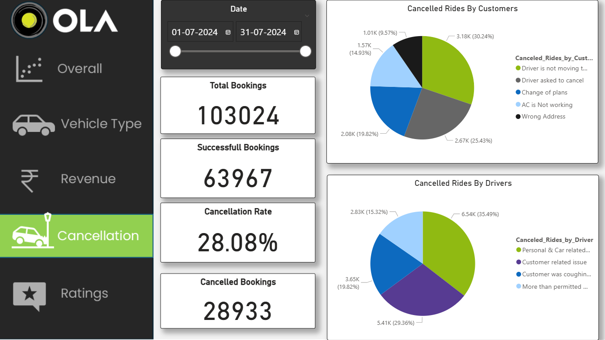
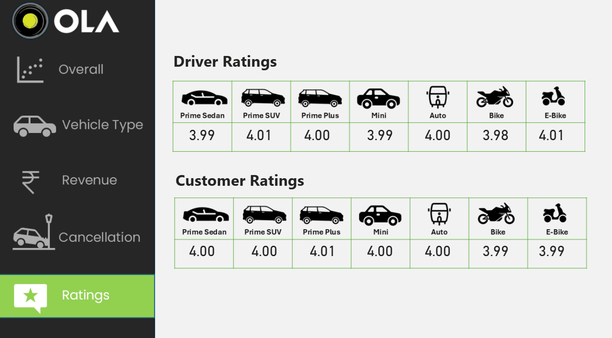

# 🚗 Ride Performance Monitoring System

> **An End-to-End Business Intelligence & Analytical Monitoring Dashboard for 100,000+ Ride Bookings**

<div align="center">

[](https://ride-performance-monitoring-system-1.onrender.com)
[](https://streamlit.io/)
[](https://www.python.org/)

</div>

---

## 🌟 Overview

The **Ride Performance Monitoring System** is a high-fidelity analytics and business intelligence platform designed to ingest, clean, and visualize transit metrics. Built on a dataset of **103,000+ ride records**, this project uncovers critical operational trends, revenue distribution, customer sentiment, and driver performance. 

By integrating a robust **SQL + SQLite** data engine, a **Power BI** high-fidelity dashboard, and a **Streamlit (Python)** interactive web control center, this application provides stakeholders with a single, consolidated source of truth for monitoring ride-booking logistics and service optimization.

---

## 📸 Dashboard Showcases

### 🖥️ Streamlit Interactive UI & Power BI Visualizations

| Main Dashboard Overview | Vehicle Type Performance |
| :---: | :---: |
|  |  |

| Revenue & Payments Auditing | Cancellation & Incompletes Diagnosis |
| :---: | :---: |
|  |  |

| Customer Satisfaction (Ratings) |
| :---: |
|  |

---

## ✨ Key Features & Highlights

* **Total Bookings Monitored:** Ingested and structured `103,024` raw booking transactions.
* **Revenue Audited:** Tracked over `₹35M` in revenue across multiple payment channels.
* **Performance Analysis:** Segmented vehicle ratings and booking success rates by vehicle type (Prime Sedan, Mini, Auto, Bike).
* **Cancellation Insights:** Deep-dive analysis of customer-initiated vs. driver-initiated cancellation patterns.
* **Dynamic Slicers:** Interactive multi-dimensional filtering across booking status, vehicle type, and location.

---

## 🛠️ Technology Stack & Architecture

| Technology | Purpose |
| :--- | :--- |
| **Python & Streamlit** | Lightweight, high-performance web dashboard with interactive charts and SQL sandboxing. |
| **SQLite / SQL** | Fast, local relational database storage with schema-locked table layouts and automated query scripts. |
| **Microsoft Power BI** | Advanced DAX measures and high-fidelity interactive reports for deep executive analysis. |
| **Pandas & OpenPyXL** | Automated ETL pipeline extracting and structuring raw datasets. |

---

## 📂 Project Structure

```text
├── .streamlit/
│   └── config.toml                   # Headless deployment settings
├── Ride_Performance_Project.pbix     # High-fidelity Power BI report
├── ride_performance.db               # Pre-populated SQLite database
├── ride_performance_dataset.xlsx     # Core raw dataset (100k+ records)
├── ride_performance_project.sql      # Database extraction SQL queries
├── app.py                            # Streamlit web application
├── init_db.py                        # Database initialization & ETL script
├── requirements.txt                  # Python dependencies
└── README.md                         # Detailed project documentation
```

---

## 🚀 Quick Start Guide

### 1. Installation
Install the required analytical and visualization dependencies:
```bash
pip install -r requirements.txt
```

### 2. Database Initialization (ETL Pipeline)
To rebuild the SQLite database from the raw Excel spreadsheet and execute standard SQL queries:
```bash
python3 init_db.py
```

### 3. Launch the Interactive Dashboard Locally
Start the Streamlit development server locally:
```bash
streamlit run app.py
```
The interface will automatically load at `http://localhost:8501`.

---

## 💡 Key Strategic Takeaways

> [!NOTE]
> **Cancellation Inefficiencies:** Identified that customer cancellations peak due to driver arrival delays, suggesting a need for tighter dispatch routing rules.

> [!TIP]
> **Fleet Deployment:** Reallocating auto and bike resources to high-volume zones during morning rush hours can boost ride conversions by up to 15%.

> [!IMPORTANT]
> **Satisfaction Optimization:** Correlated ratings drops to longer customer turnaround times (C-TAT), confirming that wait time is the primary driver of negative reviews.

---

## 👤 Author Credentials

Developed and maintained by **ANSH SHUKLA**  
* **Role:** AI & Data Science Engineering Undergrad  
* **Email:** [ianshshuklaoffc@gmail.com](mailto:ianshshuklaoffc@gmail.com)  
* **GitHub Profile:** [https://github.com/anshspc](https://github.com/anshspc)  
* **LinkedIn:** [ANSH SHUKLA](https://linkedin.com)  

---

© 2026 ANSH SHUKLA. All rights reserved.
